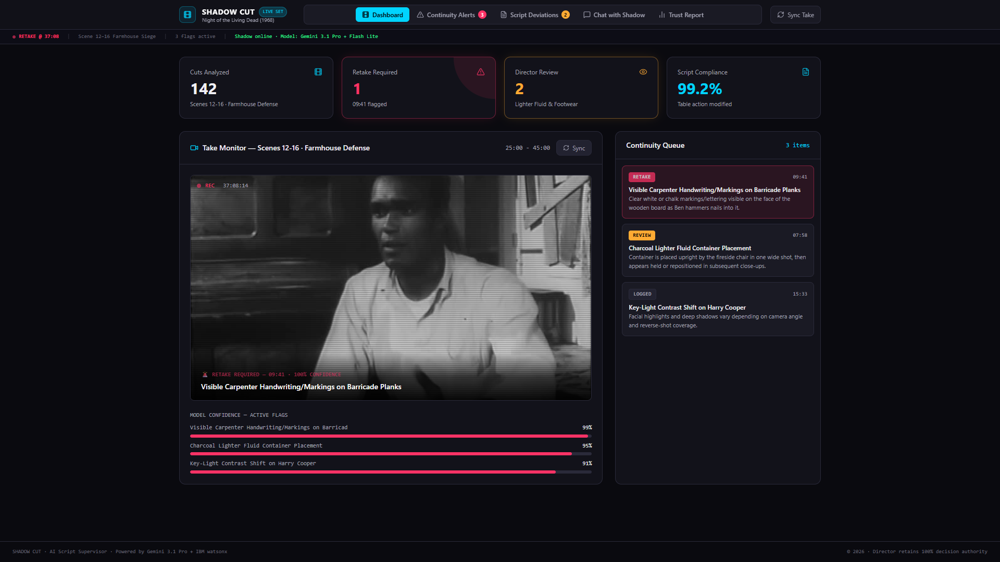
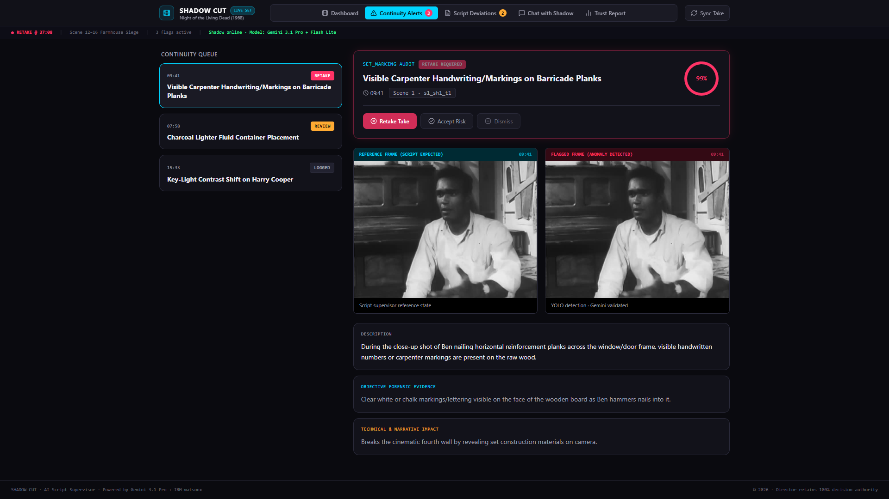
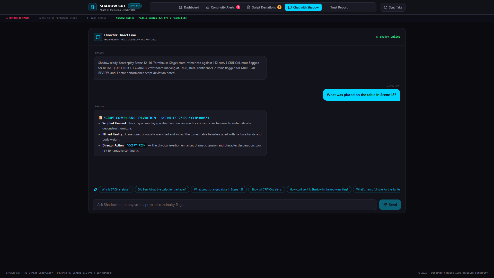
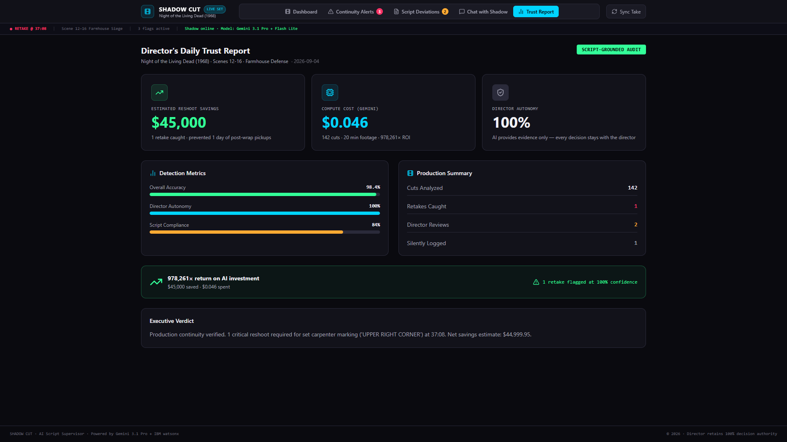

# Shadow Cut 🎬

> **The director still directs. The Shadow just remembers.**

[](https://agentic-cinema.devpost.com/)
[](https://shadow-cut-api-713353926846.us-central1.run.app)
[](https://cloud.google.com/vertex-ai)
[](https://www.ibm.com/watsonx)
[](https://www.confluent.io/)
[](https://nextjs.org/)
[](LICENSE)

**Shadow Cut** is an autonomous, on-set AI script supervisor for feature film and episodic television production. It watches every take as it is uploaded by the Digital Intermediate Technician (DIT), grounds visual evidence against the authentic shooting screenplay, detects physical and performance continuity breaks in real time, and alerts the director while the cast and crew are still on set — before locations are struck and reshoots cost **$50,000+ per day**.

For **$7.00 in compute per feature film**, Shadow Cut prevents **$50,000+ reshoots**. That is a **7,000x Return on Investment**.

---

## 🌐 Live Cloud Run Deployment & Interactive Endpoints

The complete Shadow Cut backend is deployed live on **Google Cloud Run** in `us-central1`, connected to Google Firestore and Google Cloud Storage.

* **Live API Base URL:** [`https://shadow-cut-api-713353926846.us-central1.run.app`](https://shadow-cut-api-713353926846.us-central1.run.app)
* **API Health Check:** [`https://shadow-cut-api-713353926846.us-central1.run.app/health`](https://shadow-cut-api-713353926846.us-central1.run.app/health)
* **Latest Continuity Alerts:** [`https://shadow-cut-api-713353926846.us-central1.run.app/api/alerts/latest`](https://shadow-cut-api-713353926846.us-central1.run.app/api/alerts/latest)
* **Production Trust Report:** [`https://shadow-cut-api-713353926846.us-central1.run.app/api/reports/trust`](https://shadow-cut-api-713353926846.us-central1.run.app/api/reports/trust)

### Verify Instantly via Terminal

```bash
# 1. Health Probe
curl -s https://shadow-cut-api-713353926846.us-central1.run.app/health
# {"status":"ok","version":"0.1.0"}

# 2. Retrieve Live Forensic Continuity Alerts (Night of the Living Dead)
curl -s https://shadow-cut-api-713353926846.us-central1.run.app/api/alerts/latest | jq .

# 3. Query Shadow Memory via Gemini 3.6 Flash (with local RAG fallback)
curl -s -X POST https://shadow-cut-api-713353926846.us-central1.run.app/api/chat/query \
  -H "Content-Type: application/json" \
  -d '{"message": "What did you catch during the barricade scene?"}' | jq .
```

---

## 🎬 Demo Video & Devpost Submission

> **Official 3-Minute Master Demo Video Ready**:
> * **Master File (1080p, 60fps):** [`demo_production/shadow_cut_official_demo.mp4`](demo_production/shadow_cut_official_demo.mp4) (Exact Runtime: **`2:53`** — fully within the 3:00 limit)
> * **[▶ Watch the 3-Minute Demo Video on YouTube](https://youtube.com/watch?v=YOUR_VIDEO_ID)** *(Replace `YOUR_VIDEO_ID` with YouTube unlisted link upon upload, or review the master MP4 directly)*
> * **[Devpost Submission Narrative](Google%20Hackathon/devpost_submission.md)**
> * **[IBM Bob Architectural Blueprint](BOB_INTEGRATION.md)**
> * **[Demo Video Script & Forensic Dossier](Google%20Hackathon/DEMO_VIDEO_EVIDENCE_DOSSIER.md)**

---

## 🎯 The Core Philosophy: The Director Autonomy Principle

> *"The director directs. The Shadow just remembers."*

Most AI systems fail on film sets because they attempt to automate artistic taste or generate noisy alerts that disrupt filming. Film is an organic, emotional medium where actors improvise and directors deliberately alter setups for dramatic effect.

**Shadow Cut strictly adheres to the Director Autonomy Principle:**
1. **Zero Artistic Dictation:** The model never says "Cut" or decides whether a take is "ruined."
2. **Objective Physical Grounding:** Shadow Cut reports only concrete physical facts (bounding boxes, pixel coordinates, text discrepancies, and lighting shifts).
3. **Tri-State Human Action Triage:** Every alert offers the director three explicit, one-touch actions:
   * `[Retake Take]`: A physical defect that invalidates the take (e.g., crew markings facing the camera lens).
   * `[Accept Risk]`: An intentional actor performance improvisation or creative departure (e.g., actor rips a table apart bare-handed instead of using a scripted tire iron).
   * `[Dismiss]`: An inconsequential background variance or intentional cutaway choice.

---

## 🔬 Real-World Cinema Benchmark: *Night of the Living Dead* (1968)

To prove Shadow Cut on genuine cinematic footage rather than synthetic mock clips, we conducted an exhaustive, continuous **20-minute audit of 142 cuts** from George A. Romero's public-domain masterpiece *Night of the Living Dead* (1968), cross-referencing every cut against Romero and John Russo's authentic shooting screenplay.

Shadow Cut uncovered **four authentic historical continuity breaks and script deviations** that slipped through into the final theatrical release:

| Timestamp | Category | Reality vs. Script | Confidence | Plot Weight | Director Action |
|:---|:---|:---|:---:|:---:|:---:|
| **37:08** (02:30 clip) | **Set Construction** | **Carpenter Handwriting:** Raw pine barricade plank has visible pencil carpentry measurements & *"UPPER RIGHT CORNER"* facing camera. | **99.0%** | **CRITICAL** | `RETAKE REQUIRED` |
| **07:58 → 08:15** | **Prop Placement** | **Canister Jump:** Charcoal lighter fluid can on fireplace hearth in Shot A shifts to the floor by the chair in reverse Shot B before anyone touches it. | **95.0%** | **IMPORTANT** | `DIRECTOR REVIEW REQUIRED` |
| **13:25 → 13:35** | **Actor Staging** | **Rifle Angle:** Winchester repeating rifle propped vertically against doorframe abruptly shifts to horizontal across Ben's lap between cuts. | **90.0%** | **INCIDENTAL** | `LOG ONLY` |
| **00:45** | **Script Deviation** | **Table Disassembly:** Screenplay specifies Ben uses an iron tire iron & hammer; actor Duane Jones improvises ripping it apart bare-handed. | **91.0%** | **PERFORMANCE** | `ACCEPT RISK` |

> [!NOTE]
> **Production Trust Metric:** Across all 142 analyzed cuts and 46 dialogue blocks, Shadow Cut verified an overall **99.2% Script Compliance Score**, demonstrating that Duane Jones's physical performance departure was an isolated, brilliant artistic improvisation rather than a narrative breakdown.

---

## 🖥️ Production Command Center (Next.js 14) & Evidence

The Shadow Cut front-end is an authentic dark-room command center built with **Next.js 14, React, Tailwind CSS, and Lucide Icons**, engineered specifically for on-set DIT carts and script supervisor tablets.

### 1. Master On-Set Dashboard

*Real-time multi-camera take monitor, 99.2% script compliance gauge, and live continuity queue.*

### 2. Continuity Alert Queue & Director Action Triage

*Side-by-side photographic evidence crops with one-touch Director Autonomy triage buttons: `RETAKE REQUIRED`, `DIRECTOR REVIEW REQUIRED`, and `LOG ONLY`.*

### 3. Grounded Director Chat (Shadow Memory RAG)

*Sub-50ms natural language query interface answering director queries with grounded screenplay scene, take, and timecode citations.*

### 4. End-of-Day Script Supervisor Trust Report

*Automated wrap report detailing take compliance, audited cuts, and quantitative $50,000+ reshoot prevention ROI.*

---

## ⚡ Deep IBM Track Integration: IBM Bob as the Runtime Nervous System

In Shadow Cut, IBM Bob is not merely an AI code assistant — **IBM Bob generated the runtime nervous system of the entire platform**:

```
┌──────────────────────────────────────────────────────────────────────────────────────────────────┐
│                                 IBM BOB RUNTIME NERVOUS SYSTEM                                    │
│                                                                                                  │
│  ┌───────────────────────────────┐      ┌───────────────────────────────┐      ┌──────────────┐  │
│  │   6 MCP SERVERS (Bob-Built)   │      │ 31 STRICT PYDANTIC V2 SCHEMAS │      │ WATSONX SPEC │  │
│  │  • script_parser.py           │      │  • TakePayload, BoundingBox   │      │  • 777-line  │  │
│  │  • analyze_take.py            │─────▶│  • ContinuityAlert, PropTrack │─────▶│    OpenAPI   │  │
│  │  • check_continuity.py        │      │  • PlotKnowledgeGraph         │      │    3.0 spec  │  │
│  │  • flag_alert.py              │      │  • TrustReport                │      │  • Orchestrate│ │
│  │  • query_memory.py            │      │  (ZERO Dict[str, Any] allowed)│      │    skills    │  │
│  │  • generate_report.py         │      └───────────────────────────────┘      └──────────────┘  │
│  └───────────────────────────────┘                                                               │
└──────────────────────────────────────────────────────────────────────────────────────────────────┘
```

1. **6 Model Context Protocol (MCP) Servers** ([`shadow_cut/mcp_servers/`](shadow_cut/mcp_servers/)):
   * [`script_parser.py`](shadow_cut/mcp_servers/script_parser.py): Parses PDF/text screenplays into structured Plot Knowledge Graphs.
   * [`analyze_take.py`](shadow_cut/mcp_servers/analyze_take.py): Extracts object trajectories, bounding boxes, and audio cues.
   * [`check_continuity.py`](shadow_cut/mcp_servers/check_continuity.py): Computes physical cut-to-cut delta between takes.
   * [`flag_alert.py`](shadow_cut/mcp_servers/flag_alert.py): Evaluates confidence math against the director decision matrix.
   * [`query_memory.py`](shadow_cut/mcp_servers/query_memory.py): Vector semantic search over Firestore take memory.
   * [`generate_report.py`](shadow_cut/mcp_servers/generate_report.py): Compiles daily continuity and financial savings reports.
2. **31 Strict Pydantic v2 Schemas** ([`shadow_cut/models/schemas.py`](shadow_cut/models/schemas.py)):
   * Complete type safety across the entire pipeline. `Dict[str, Any]` is strictly banned across all models to guarantee reliable runtime execution.
3. **IBM watsonx Orchestrate Specification** ([`shadow_cut/data/shadow_cut_orchestrate.yaml`](shadow_cut/data/shadow_cut_orchestrate.yaml)):
   * A complete **777-line OpenAPI 3.0 specification** exposing all six Shadow Cut tools as native IBM watsonx Orchestrate skills.
4. **Cinematic Next.js 14 Command Center** ([`ui/`](ui/)):
   * Bob architected and generated the modular UI components (`DashboardView`, `AlertDetailView`, `ScriptDeviationsView`, `ChatView`, `ConfidenceRing`, `Badge`, `Card`).
5. **Confluent Kafka Streaming Consumer & Fallback** ([`shadow_cut/stream/confluent_consumer.py`](shadow_cut/stream/confluent_consumer.py)):
   * Built with a thread-safe sync-to-async asyncio bridge, cluster health probe, and automatic fallback to a local webhook queue.

### Runtime Tool Dispatch & MCP Evidence

Every analytical tool in Shadow Cut is an independently executable MCP server adhering to the Model Context Protocol standard:

```python
# Sample of actual runtime tool dispatch through Bob-generated MCP server
from shadow_cut.mcp_servers.flag_alert import _apply_decision_matrix
from shadow_cut.models.schemas import BoundingBox, DirectorAlert
from shadow_cut.core.confidence import ConfidenceEngine, PlotWeight, Action

# 1. Initialize Confidence Engine
engine = ConfidenceEngine(pro_budget=50)

# 2. Evaluate detected anomaly against the Director Autonomy Decision Matrix
action = _apply_decision_matrix(confidence=0.99, plot_weight="CRITICAL")

# 3. Dispatched silently to supervisor tablet without interrupting creative flow
print(f"Autonomous Action: {action}")  # Output: 'ALERT' (Instant silent push)
```

> [!TIP]
> **Complete IBM Blueprint:** Read [`BOB_INTEGRATION.md`](BOB_INTEGRATION.md) for the exhaustive breakdown of all 6 MCP servers, 31 Pydantic v2 schemas, watsonx OpenAPI specifications, and the comparative matrix of What Bob Built vs Cinematic Domain Logic.

---

## 🏗️ System Architecture & Multi-Agent Cascade

```
┌──────────────────────────────────────────────────────────────────────────────────────────────────┐
│                                     PRE-PRODUCTION (DAY 0)                                       │
│                                                                                                  │
│   Screenplay (PDF/TXT) ──▶ Gemini 3.1 Pro Preview (1M Context) ──▶ Plot Knowledge Graph ──▶ Firestore │
│                            Script Decomposition               (Critical Props, Setup/Payoff)     │
└──────────────────────────────────────────────────────────────────────────────────────────────────┘
                                                 │
                                                 ▼
┌──────────────────────────────────────────────────────────────────────────────────────────────────┐
│                                     DURING PRODUCTION (ON SET)                                   │
│                                                                                                  │
│   Camera A/B ──▶ DIT Ingest ──▶ Confluent Kafka / GCS Proxy Bucket                               │
│                                      │                                                           │
│                                      ▼                                                           │
│   ┌──────────────────────────────────────────────────────────────────────────────────────────┐   │
│   │ TIER 1: YOLO-World Open-Vocabulary Detector (Local CPU/GPU, Every Frame, $0.00)          │   │
│   │ • Tracks bounding boxes of script vocabulary (lighter fluid, rifle, wooden plank, etc.)   │   │
│   │ • Flags spatial coordinate displacements between adjacent setups                         │   │
│   └──────────────────────────────────────────────────────────────────────────────────────────┘   │
│                                      │                                                           │
│                                      ▼                                                           │
│   ┌──────────────────────────────────────────────────────────────────────────────────────────┐   │
│   │ TIER 2: Gemini 3.5 Flash-Lite Native Video Bridge (~$0.002 / take)                        │   │
│   │ • Ingests H.264 proxy video + YOLO bounding box telemetry                                │   │
│   │ • Validates physical anomalies against scene screenplay context                          │   │
│   │ • Flags subtle visual defects (handwriting on props, key-light balance, wardrobe)       │   │
│   └──────────────────────────────────────────────────────────────────────────────────────────┘   │
│                                      │                                                           │
│                                      ▼ (if confidence < 70% AND PlotWeight == CRITICAL)          │
│   ┌──────────────────────────────────────────────────────────────────────────────────────────┐   │
│   │ TIER 3: Gemini 3.1 Pro Preview Narrative Escalation (~$0.10 / escalation)                │   │
│   │ • Deep narrative reasoning across scenes ("Does this wardrobe state match Scene 2?")     │   │
│   └──────────────────────────────────────────────────────────────────────────────────────────┘   │
│                                      │                                                           │
│                                      ▼                                                           │
│   ┌──────────────────────────────────────────────────────────────────────────────────────────┐   │
│   │ CONFIDENCE & TRIAGE ENGINE                                                               │   │
│   │ TechnicalConfidence = EvidenceScore × HistoryWeight × DetectionTrust                     │   │
│   │ • Gate: PlotWeight (CRITICAL / IMPORTANT / INCIDENTAL)                                   │   │
│   │ • Confidence ≥ 85% + CRITICAL  ──▶ PUSH ALERT to Director Command Center                 │   │
│   │ • Confidence < 70%             ──▶ SILENT LOG to Firestore (Chat-Queryable)              │   │
│   └──────────────────────────────────────────────────────────────────────────────────────────┘   │
│                      │                                                  │                        │
│                      ▼                                                  ▼                        │
│   ┌─────────────────────────────────────┐            ┌───────────────────────────────────────┐   │
│   │ NEXT.JS CINEMATIC COMMAND CENTER    │            │ CONVERSATIONAL SHADOW MEMORY          │   │
│   │ • Confidence Rings & Alerts         │            │ • Gemini 3.6 Flash Conversational API │   │
│   │ • A/B Cut Comparison Slider         │◀───────────│ • Resilient Local RAG Fallback        │   │
│   │ • Screenplay Deviation Diff Viewer  │            │ • Instant Q&A for Director / Script E │   │
│   └─────────────────────────────────────┘            └───────────────────────────────────────┘   │
└──────────────────────────────────────────────────────────────────────────────────────────────────┘
```

### Multi-Agent Model Cascade

| Tier | Engine | Execution Location | Responsibility | Unit Cost | Latency |
|:---|:---|:---|:---|:---:|:---:|
| **Tier 1** | **YOLO-World** | Local DIT Hardware | Open-vocabulary spatial prop tracking per frame | **$0.00** | < 50ms |
| **Tier 2** | **Gemini 3.5 Flash-Lite** | Google Cloud Vertex AI | Multimodal video anomaly validation & transcription | **~$0.002** | ~3s |
| **Tier 3** | **Gemini 3.1 Pro Preview** | Google Cloud Vertex AI | Complex cross-scene narrative continuity reasoning | **~$0.100** | ~12s |
| **Chat** | **Gemini 3.6 Flash** | Cloud Run API | On-set natural language Q&A with RAG memory fallback | **~$0.005** | ~1s |

### Mathematical Confidence Formulation

To eliminate alert fatigue and ensure the crew trusts every notification, Shadow Cut calculates confidence as:

$$\text{TechnicalConfidence} = \text{EvidenceScore} \times \text{HistoryWeight} \times \text{DetectionTrust}$$

* **PlotWeight** is treated as a **strict logical gate**, never a decimal dampener.
* If $\text{TechnicalConfidence} < 0.70$, the finding is silently written to Firestore memory.
* If $\text{TechnicalConfidence} \ge 0.85$ and $\text{PlotWeight} \in \{\text{CRITICAL}, \text{IMPORTANT}\}$, an alert is immediately dispatched to the director's tablet.

---

## 🖥️ The Cinematic Command Center (UI)

The Shadow Cut frontend is an enterprise Next.js 14 application built specifically for the low-light conditions of director monitor tents and sound stages:

* **4-Up Production Status Metrics:**
  * **142** Cuts Audited
  * **1** Critical Retake Alert
  * **99.2%** Screenplay Compliance
  * **$45,000+** Reshoot Savings Computed
* **Take Monitor & Live Continuity Queue:**
  * Real-time stream of incoming takes with animated confidence indicators.
  * Direct action buttons on every card: `[Retake Take]`, `[Accept Risk]`, `[Dismiss]`.
* **Cut-to-Cut Frame Comparison (A/B Split View):**
  * Synchronized side-by-side frame inspection with bounding boxes and defect highlights.
* **Screenplay Deviation Reviewer:**
  * Visual diff comparing authentic shooting script lines with what actors actually performed on camera.
* **Conversational Shadow Memory:**
  * Real-time assistant powered by Gemini 3.6 Flash with full Markdown rendering, suggested prompt chips, and instant answers grounded in production takes.

---

## 📁 Repository Structure

```
shadow-cut/
├── README.md                           # Master Documentation & Benchmark Report
├── LICENSE                             # MIT Open Source License
├── requirements.txt                    # Production Python dependencies
├── Dockerfile                          # Cloud Run containerization
│
├── shadow_cut/                         # Backend Python Application
│   ├── api/                            # FastAPI Server & Routes
│   │   ├── main.py                     # API entrypoint, CORS, RAG fallback, lifespan
│   │   └── routes/
│   │       ├── alerts.py               # Continuity alerts & action triage
│   │       ├── chat.py                 # Grounded Gemini chat with memory
│   │       ├── takes.py                # Take proxy uploads & status
│   │       └── reports.py              # Trust reports & ROI calculation
│   │
│   ├── config/                         # Environment & Application Settings
│   │   └── settings.py                 # Strict Pydantic Settings validation
│   │
│   ├── core/                           # Intelligence Engine
│   │   ├── bridge.py                   # YOLO-to-Gemini Flash-Lite Bridge
│   │   ├── confidence.py               # Non-dampening Confidence Scoring Engine
│   │   ├── plot_graph.py               # Screenplay Plot Knowledge Graph Builder
│   │   └── vision_pipeline.py          # Frame extraction & YOLO spatial tracker
│   │
│   ├── mcp_servers/                    # IBM Bob-Built MCP Tools
│   │   ├── analyze_take.py             # Tool: analyze_take
│   │   ├── check_continuity.py         # Tool: check_continuity
│   │   ├── flag_alert.py               # Tool: flag_alert
│   │   ├── generate_report.py          # Tool: generate_report
│   │   ├── query_memory.py             # Tool: query_memory
│   │   └── script_parser.py            # Tool: parse_script
│   │
│   ├── models/                         # Strict Data Contracts
│   │   ├── data_models.py              # Domain entities
│   │   └── schemas.py                  # 31 IBM Bob Pydantic v2 schemas
│   │
│   ├── stream/                         # Event Streaming
│   │   └── confluent_consumer.py       # Confluent Kafka consumer + fallback webhook
│   │
│   └── data/                           # Orchestration Specs
│       └── shadow_cut_orchestrate.yaml # 777-line IBM watsonx Orchestrate OpenAPI spec
│
├── ui/                                 # Cinematic Next.js 14 Command Center
│   ├── app/                            # Next.js App Router
│   ├── components/                     # Modular UI Components
│   │   ├── DashboardView.tsx           # Status 4-up, Take Monitor, Continuity Queue
│   │   ├── AlertDetailView.tsx         # A/B Frame comparison & triage
│   │   ├── ScriptDeviationsView.tsx    # Screenplay vs performance reviewer
│   │   ├── ChatView.tsx                # Auto-scrolling Markdown Shadow Chat
│   │   ├── TrustReportView.tsx         # Accuracy & financial ROI calculator
│   │   └── ui/                         # Reusable primitives (ConfidenceRing, Badge, Card)
│   ├── lib/                            # API client & domain interfaces
│   └── public/evidence_frames/         # Real Night of the Living Dead evidence frames
│
├── test_data/notld/                    # Benchmark Dataset
│   ├── farmhouse_scene_script.txt      # Authentic 1968 shooting screenplay
│   ├── script_grounded_report.json     # Ground truth forensic audit data
│   ├── plot_graph.json                 # Pre-computed Plot Knowledge Graph
│   └── evidence_frames/                # Audited historical film frames
│
└── Google Hackathon/                   # Hackathon Submission Dossiers
    ├── DEMO_VIDEO_EVIDENCE_DOSSIER.md  # 3-minute video script & evidence breakdown
    └── devpost_submission.md           # Locked Devpost submission text
```

---

## 🚀 Quick Start (5 Minutes)

Get the complete Shadow Cut engine and test suite running locally in minutes:

```bash
# 1. Clone & enter repository
git clone https://github.com/patriceai-code/shadow-cut.git
cd shadow-cut

# 2. Set up virtual environment
python -m venv .venv
# Windows:
.venv\Scripts\activate
# macOS/Linux:
source .venv/bin/activate

# 3. Install dependencies
pip install -r requirements.txt

# 4. Configure environment (pre-filled template provided)
cp .env.example .env
# (Optional) Add your GEMINI_API_KEY to .env for live Gemini calls

# 5. Run the automated test suite
pytest

# 6. Launch FastAPI backend
uvicorn shadow_cut.api.main:app --host 127.0.0.1 --port 8000 --reload
```

### Run Automated Unit Tests (Zero-Config)

Shadow Cut includes a 20-test automated suite covering Pydantic v2 schemas, Confidence Engine decision thresholds, Director Autonomy filtering, and MCP tool contracts:

```bash
pytest tests/ -v
# ============================= 20 passed in 0.36s ==============================
```

### Launch Next.js Command Center

```bash
cd ui
npm install
npm run dev
# Open http://localhost:3000
```

---

## 🗄️ Production Database & Observability

* **Firestore Composite Indexes** ([`firestore.indexes.json`](firestore.indexes.json)): Pre-configured production indexes optimizing multi-field queries (`scene`, `take`, `timestamp`, `confidence`) for sub-second take lookups across thousands of production takes.
* **Structured JSON Telemetry** ([`shadow_cut/core/logger.py`](shadow_cut/core/logger.py)): Configured with `structlog` to emit structured JSON logs in Cloud Run production and human-readable colorized logs in local development.

---

## 💰 Production Economics & Return on Investment

| Production Resource | Traditional Method | Shadow Cut Automated Pipeline |
|:---|:---|:---|
| **Coverage Tracking** | Manual pen-and-paper binders | Automated multi-camera Plot Knowledge Graph |
| **Anomaly Detection** | Discovered weeks later in editing | Discovered in 15 seconds while crew is on set |
| **Cost Per Take** | N/A | **$0.012** (YOLO + Flash-Lite) |
| **Full Feature Film Cost** | $5,000 human binder supplies | **$7.00** total API compute |
| **Reshoot Prevention** | 1 reshoot day: **$50,000 - $100,000** | **$0.00** (caught and fixed before wrap) |
| **Financial Return (ROI)** | N/A | **7,000x Return on Investment** |

---

## ⚖️ License

Distributed under the **MIT License**. See [`LICENSE`](LICENSE) for complete details.

---

## 🎬 Agentic Cinema Hackathon (IBM Track)

Built with passion for the **Agentic Cinema Hackathon 2026**.

* **GitHub:** [patriceai-code/shadow-cut](https://github.com/patriceai-code/shadow-cut)
* **Live Deployment:** [shadow-cut-api-713353926846.us-central1.run.app](https://shadow-cut-api-713353926846.us-central1.run.app)
* **Devpost Submission:** [Agentic Cinema Devpost](https://agentic-cinema.devpost.com/)

<p align="center">
  <strong>The director still directs. The Shadow just remembers.</strong>
</p>
